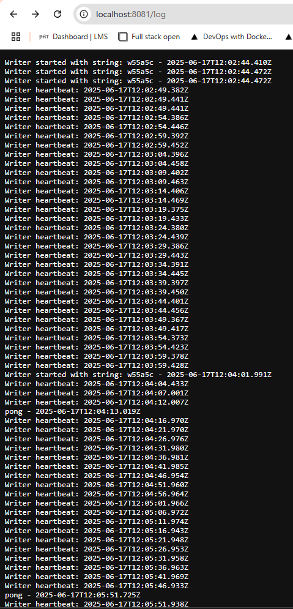

## Assignment

> 
> Let's share data between "Ping-pong" and "Log output" applications using persistent volumes. Create both a *PersistentVolume* and *PersistentVolumeClaim* and alter the *Deployment* to utilize it. As PersistentVolumes are often maintained by cluster administrators rather than developers and those are not application specific you should keep the definition for those separated, perhaps in own folder.
> 
> Save the number of requests to "Ping-pong" application into a file in the volume and output it with the timestamp and hash when sending a request to our "Log output" application. In the end, the two pods should share a persistent volume between the two applications. So the browser should display the following when accessing the "Log output" application:
> 
>     2020-03-30T12:15:17.705Z: 8523ecb1-c716-4cb6-a044-b9e83bb98e43.
>     Ping / Pongs: 3

## Solution

Application was built in Rust. It listens for a GET request on `localhost:8081`. 

[**Deployment**](https://github.com/VikSil/DevOps_with_Kubernetes/tree/trunk/Part1/Exercise_1.11/manifests/deployment.yaml)

```
apiVersion: apps/v1
kind: Deployment
metadata:
  name: log-output
spec:
  replicas: 1
  selector:
    matchLabels:
      app: log-output
  template:
    metadata:
      labels:
        app: log-output
    spec:
      volumes:
        - name: shared-logs
          persistentVolumeClaim:
            claimName: shared-pvc
      containers:
        - name: log-writer
          image: bachthyaglx/log-writer:v1
          volumeMounts:
            - name: shared-logs
              mountPath: /usr/src/app/data
        - name: log-reader
          image: bachthyaglx/log-reader:v1
          volumeMounts:
            - name: shared-logs
              mountPath: /usr/src/app/data
          env:
            - name: PORT
              value: "3033"
        - name: pingpong
          image: bachthyaglx/pingpong:v1
          volumeMounts:
            - name: shared-logs
              mountPath: /usr/src/app/data
          env:
            - name: PORT
              value: "3034"
```

[**Service**](https://github.com/VikSil/DevOps_with_Kubernetes/tree/trunk/Part1/Exercise_1.11/manifests/service.yaml)

```
apiVersion: v1
kind: Service
metadata:
  name: log-output-pingpong-service
spec:
  type: ClusterIP
  selector:
    app: log-output
  ports:
    - name: pingpong
      port: 3032
      protocol: TCP
      targetPort: 3034
    - name: get-log-output
      port: 3011
      protocol: TCP
      targetPort: 3033
```

[**Ingress**](https://github.com/VikSil/DevOps_with_Kubernetes/tree/trunk/Part1/Exercise_1.11/manifests/Ingress.yaml)

```
apiVersion: networking.k8s.io/v1
kind: Ingress
metadata:
  name: log-output-ingress
  annotations:
    traefik.ingress.kubernetes.io/router.entrypoints: web
spec:
  ingressClassName: traefik
  rules:
    - http:
        paths:
          - path: /log
            pathType: Prefix
            backend:
              service:
                name: log-output-pingpong-service
                port:
                  number: 3011
          - path: /pingpong
            pathType: Prefix
            backend:
              service:
                name: log-output-pingpong-service
                port:
                  number: 3032
```

[**Persistent Volume**](https://github.com/VikSil/DevOps_with_Kubernetes/tree/trunk/Part1/Exercise_1.11/volumes/persistentvolume.yaml)

```
apiVersion: v1
kind: PersistentVolume
metadata:
  name: shared-pv
spec:
  capacity:
    storage: 1Gi
  accessModes:
    - ReadWriteMany
  hostPath:
    path: /tmp/kube/shared
  persistentVolumeReclaimPolicy: Retain
```

[**Persistent Volume Claim**](https://github.com/VikSil/DevOps_with_Kubernetes/tree/trunk/Part1/Exercise_1.11/volumes/persistentvolumeclaim.yaml)

```
apiVersion: v1
kind: PersistentVolumeClaim
metadata:
  name: shared-pvc
spec:
  accessModes:
    - ReadWriteOnce
  resources:
    requests:
      storage: 1Gi
```

### Commands

```bash
# create cluster
k3d cluster create log-cluster --agents 1 --port 8081:80@loadbalancer

# build
docker build -t bachthyaglx/pingpong:v1 ./pingpong
docker build -t bachthyaglx/log-writer:v1 ./log-writer
docker build -t bachthyaglx/log-reader:v1 ./log-reader

# push
docker push bachthyaglx/pingpong:v1
docker push bachthyaglx/log-writer:v1
docker push bachthyaglx/log-reader:v1

# apply persistentvolume
docker exec k3d-log-cluster-agent-0 mkdir -p /tmp/kube # prepare volume path
kubectl apply -f manifests/persistentvolume.yaml
kubectl apply -f manifests/persistentvolumeclaim.yaml
kubectl get persistentvolume
kubectl get persistentvolumeclaim

# apply 
kubectl apply -f manifests/
kubectl get pods,svc,ingress
```

### GET Requests


