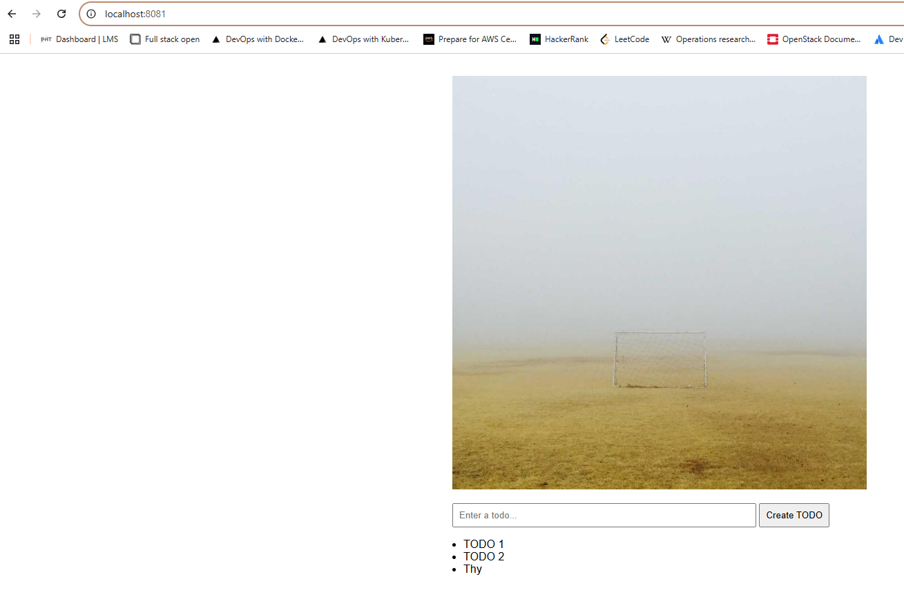

## Assignment

> 
> For the project, we'll need to do some coding to start seeing results in the next part.
> 
> 1. Add an input field. The input should not take todos that are over 140 characters long.
> 2. Add a send button. It does not have to send the todo yet.
> 3. Add a list of the existing todos with some hardcoded todos.
> 
> Maybe something similar to this:
> 
> 

## Solution

Application was built in Rust. By default the application listens at `localhost:8081/`, if no `PORT` environment variable is provided. It returns an HTML age with a single random image downloaded from `https://picsum.photos/1200`. By default the image is replaced every hour, but it is possible to specify an environemnt variable `TIMEOUT` (in seconds) to specify how frequently a new picture should be returned. 

[**Deployment**](https://github.com/VikSil/DevOps_with_Kubernetes/tree/trunk/Part1/Exercise_1.12/manifests/deployment.yaml)

```bash
apiVersion: apps/v1
kind: Deployment
metadata:
  name: image-cache
spec:
  replicas: 1
  selector:
    matchLabels:
      app: image-cache
  template:
    metadata:
      labels:
        app: image-cache
    spec:
      volumes:
        - name: shared-image
          persistentVolumeClaim:
            claimName: image-claim
      containers:
        - name: image-cache-container
          image: bachthyaglx/image-cache:latest
          ports:
            - containerPort: 3000
          volumeMounts:
            - name: shared-image
              mountPath: /usr/src/app/data
```

[**Service**](https://github.com/VikSil/DevOps_with_Kubernetes/tree/trunk/Part1/Exercise_1.08/manifests/service.yaml)

```bash
apiVersion: v1
kind: Service
metadata:
  name: image-cache-svc
spec:
  selector:
    app: image-cache
  ports:
    - port: 80
      targetPort: 3000
```

[**Ingress**](https://github.com/VikSil/DevOps_with_Kubernetes/tree/trunk/Part1/Exercise_1.08/manifests/ingress.yaml)

```bash
apiVersion: networking.k8s.io/v1
kind: Ingress
metadata:
  name: image-cache-ingress
  annotations:
    traefik.ingress.kubernetes.io/router.entrypoints: web
spec:
  ingressClassName: traefik
  rules:
    - http:
        paths:
          - path: / # serve HTML + todos
            pathType: Prefix
            backend:
              service:
                name: image-cache-svc
                port:
                  number: 80
          - path: /image
            pathType: Prefix
            backend:
              service:
                name: image-cache-svc
                port:
                  number: 80
```

[**Persistent Volume**](https://github.com/VikSil/DevOps_with_Kubernetes/tree/trunk/Part1/Exercise_1.12/volumes/persistentvolume.yaml)

```bash
apiVersion: v1
kind: PersistentVolume
metadata:
  name: example-pv
spec:
  storageClassName: my-example-pv # this is the name you are using later to claim this volume
  capacity:
    storage: 1Gi # Could be e.q. 500Gi. Small amount is to preserve space when testing locally
  volumeMode: Filesystem # This declares that it will be mounted into pods as a directory
  accessModes:
    - ReadWriteOnce
  local:
    path: /tmp/kube
  nodeAffinity: ## This is only required for local, it defines which nodes can access it
    required:
      nodeSelectorTerms:
        - matchExpressions:
            - key: kubernetes.io/hostname
              operator: In
              values:
                - k3d-mycluster-agent-0 # This is the name of the node where the volume is located, change it to your node name
```

[**Persistent Volume Claim**](https://github.com/VikSil/DevOps_with_Kubernetes/tree/trunk/Part1/Exercise_1.12/volumes/persistentvolumeclaim.yaml)

```bash
apiVersion: v1
kind: PersistentVolumeClaim
metadata:
  name: image-claim # name of the volume claim, this will be used in the deployment
spec:
  storageClassName: my-example-pv # this is the name of the persistent volume we are claiming
  accessModes:
    - ReadWriteOnce
  resources:
    requests:
      storage: 1Gi
```

### Commands

```bash
kubectl apply -f manifests/
```

### Webpage


