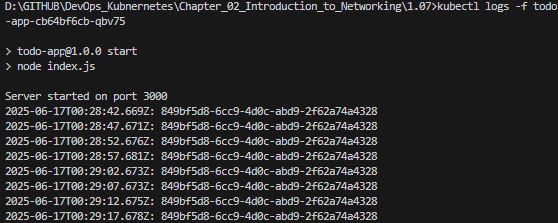

## Assignment

> 
> "Log output" application currently outputs a timestamp and a random string to the logs.
> 
> Add an endpoint to request the current status (timestamp and string) and an ingress so that you can access it with a browser.
> 
> You can just store the string and timestamp to the memory.

## Solution

### Binaries

- Application was built in Rust.  It listens for a GET request on `localhost:3011`. Source code can be found [here](https://github.com/VikSil/DevOps_with_Kubernetes/tree/trunk/Part1/Exercise_1.07/app).
- Image was pushed to Docker Hub repo [viksil/log_output:1.07](https://hub.docker.com/r/viksil/log_output/tags?name=1.07).

### Manifests

Port `3000` was mapped all the way through for simplicity.

[**Deployment**](https://github.com/bachthyaglx/devops_kubernetes/tree/main/Chapter_02_Introduction_to_Networking/1.07/manifests/deployment.yaml)

```
apiVersion: apps/v1
kind: Deployment
metadata:
  name: todo-app # Name of the deployment
spec:
  replicas: 1
  selector:
    matchLabels:
      app: todo-app
  template:
    metadata:
      labels:
        app: todo-app
    spec:
      containers:
        - name: todo-app
          image: todo-app:v0.1
```

[**Service**](https://github.com/bachthyaglx/devops_kubernetes/tree/main/Chapter_02_Introduction_to_Networking/1.07/manifests/service.yaml)

```
apiVersion: v1
kind: Service
metadata:
  name: log-output-svc
spec:
  type: ClusterIP
  selector:
    app: log-output # This is the app as declared in the deployment.
  ports:
    - port: 2345
      protocol: TCP
      targetPort: 3000
```

[**Ingress**](https://github.com/VikSil/DevOps_with_Kubernetes/tree/trunk/Part1/Exercise_1.07/manifests/Ingress.yaml)

```
apiVersion: networking.k8s.io/v1
kind: Ingress
metadata:
  name: log-output-ingress
  annotations:
    traefik.ingress.kubernetes.io/router.entrypoints: web
spec:
  ingressClassName: traefik # Specify the Ingress class to use
  rules:
    - http:
        paths:
          - path: /status
            pathType: Prefix
            backend:
              service:
                name: log-output-svc # Name of the service to route traffic to
                port:
                  number: 3000
```

### Commands

```bash
k3d cluster create --port 8082:30080@agent:0 -p 8081:80@loadbalancer --agents 2
docker build -t todo-app:v0.1 .
k3d image import todo-app:v0.1 -c k3s-default
kubectl apply -f manifests/
kubectl get deployments
kubectl get pods
kubectl logs -f todo-app-cb64bf6cb-qbv75
kubectl port-forward deployment/todo-app 3000:3000
```

### GET Request to Forwarded Port

