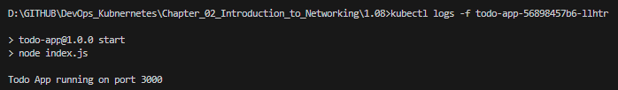

## Assignment

> 
> Switch to using Ingress instead of NodePort to access the project. You can delete the ingress of the "Log output" application so they don't interfere with this exercise. We'll look more into paths and routing in the next exercise and at that point you can configure project to run with the "Log output" application side by side.

## Solution

Application was built in Rust.  It listens for a GET request on `localhost:8081/`. 

[**Deployment**](https://github.com/VikSil/DevOps_with_Kubernetes/tree/trunk/Part1/Exercise_1.08/manifests/deployment.yaml)

Unchanged deployment manifest from [Exercise 1.04](https://github.com/VikSil/DevOps_with_Kubernetes/tree/trunk/Part1/Exercise_1.04) was used. It sets `PORT` environment variable to `8088` and specifies the target Docker hub image.


[**Service**](https://github.com/bachthyaglx/devops_kubernetes/tree/main/Chapter_02_Introduction_to_Networking/1.08/manifests/service.yaml)

```
apiVersion: v1
kind: Service
metadata:
  name: todo-app-service
spec:
  type: ClusterIP
  selector:
    app: todo-app
  ports:
    - port: 3012
      protocol: TCP
      targetPort: 8088
```

[**Ingress**](https://github.com/bachthyaglx/devops_kubernetes/tree/main/Chapter_02_Introduction_to_Networking/1.07/manifests/ingress.yaml)

```
apiVersion: networking.k8s.io/v1
kind: Ingress
metadata:
  name: todo-app-ingress
spec:
  rules:
  - http:
      paths:
      - path: /
        pathType: Prefix
        backend:
          service:
            name: todo-app-service
            port:
              number: 3012
```

### Commands

- This exercise used the same cluster that was created for [previous exercise](https://github.com/bachthyaglx/devops_kubernetes/tree/main/Chapter_02_Introduction_to_Networking/1.07). Loadbalancer HTTP port `80` is exposed to outside requests on `localhost:3011`.

- Ingress for `log-output` app was removed to prevent a clash.

```bash
k3d cluster create --port 8082:30080@agent:0 -p 8081:80@loadbalancer --agents 2
docker build -t todo-app:v0.1 .
k3d image import todo-app:v0.1 -c k3s-default
kubectl apply -f manifests/
kubectl get deployments
kubectl get pods
kubectl logs -f todo-app-cb64bf6cb-qbv75
kubectl port-forward deployment/todo-app 3000:3000
```

### GET Request to Forwarded Port

