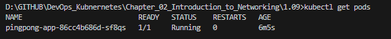

## Assignment

> 
> Develop a second application that simply responds with "pong 0" to a GET request and increases a counter (the 0) so that you can see how many requests have been sent. The counter should be in memory so it may reset at some point. Create a new deployment for it and have it share ingress with "Log output" application. Route requests directed '/pingpong' to it.
> 
> In future exercises, this second application will be referred to as "ping-pong application". It will be used with "Log output" application.
> 
> The ping-pong application will need to listen requests on '/pingpong', so you may have to make changes to its code. This can be avoided by configuring the ingress to rewrite the path, but we will leave that as an optional exercise. You can check out https://kubernetes.io/docs/concepts/services-networking/ingress/#the-ingress-resource

## Solution

Application was built in Rust.  It listens for a GET request on `localhost:8081/pingpong`. 

[**Deployment**](https://github.com/VikSil/DevOps_with_Kubernetes/tree/trunk/Part1/Exercise_1.09/manifests/deployment.yaml)

```
apiVersion: apps/v1
kind: Deployment
metadata:
  name: pingpong-app
spec:
  replicas: 1
  selector:
    matchLabels:
      app: pingpong
  template:
    metadata:
      labels:
        app: pingpong
    spec:
      containers:
        - name: pingpong
          image: bachthyaglx/pingpong:v0.1
```

[**Service**](https://github.com/VikSil/DevOps_with_Kubernetes/tree/trunk/Part1/Exercise_1.09/manifests/service.yaml)

```
apiVersion: v1
kind: Service
metadata:
  name: pingpong-service
spec:
  type: ClusterIP
  selector:
    app: pingpong
  ports:
    - port: 3032
      protocol: TCP
      targetPort: 3033
```

[**Ingress**](https://github.com/VikSil/DevOps_with_Kubernetes/tree/trunk/Part1/Exercise_1.09/manifests/Ingress.yaml)

```
apiVersion: networking.k8s.io/v1
kind: Ingress
metadata:
  name: shared-ingress
spec:
  rules:
    - host: localhost
      http:
        paths:
          - path: /pingpong
            pathType: Prefix
            backend:
              service:
                name: pingpong-service # /pingpong
                port:
                  number: 3032
          - path: /
            pathType: Prefix
            backend:
              service:
                name: log-output-service # / from log-output app
                port:
                  number: 3011
```

### Commands

```bash
docker build -t bachthyaglx/pingpong:v0.1 .
docker push bachthyaglx/pingpong:v0.1
k3d cluster create --port 8082:30080@agent:0 -p 8081:80@loadbalancer --agents 2
kubectl apply -f manifests/
kubectl get pods
kubectl get svc
kubectl get ingress
```

### GET Request to /pingpong

