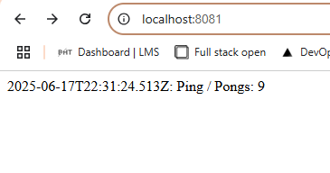
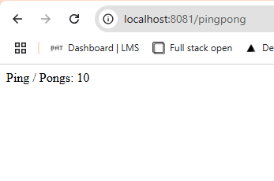

## Assignment

> 
> Connect the "Log output" application and "Ping-pong" application. Instead of sharing data via files use HTTP endpoints to respond with the number of pongs. Deprecate all the volume between the two applications for the time being.
> 
> The output will stay the same:
> 
>     2020-03-30T12:15:17.705Z: 8523ecb1-c716-4cb6-a044-b9e83bb98e43.
>     Ping / Pongs: 3

## Solution

Application was built in Rust. Application listens to port 3022. When a get request is received, it sends requests to endpoints `http://localhost:8081/pingpong` and `http://localhost:8081`. It concatenates the responses and returns the result to the user. For the purposes of the exercise the endpoints are hard-coded, but for a more general usecase, environment variables could be used. 

### Commands

```bash
k3d cluster create mycluster --agents 1 --port "8081:80@loadbalancer" --volume /tmp/kube:/tmp/kube@agent:0
docker build -t bachthyaglx/pingpong:latest ./pingpong
docker push bachthyaglx/pingpong:latest
docker build -t bachthyaglx/log-output:latest ./log-output
docker push bachthyaglx/log-output:latest
kubectl apply -f pingpong/k8s/
kubectl apply -f log-output/k8s/
kubectl get pods,svc,ingress

# Troubleshootings
kubectl rollout restart deployment log-output-dep
kubectl rollout restart deployment pingpong-dep
kubectl get pods
kubectl logs <pod>
```

### GET Requests




