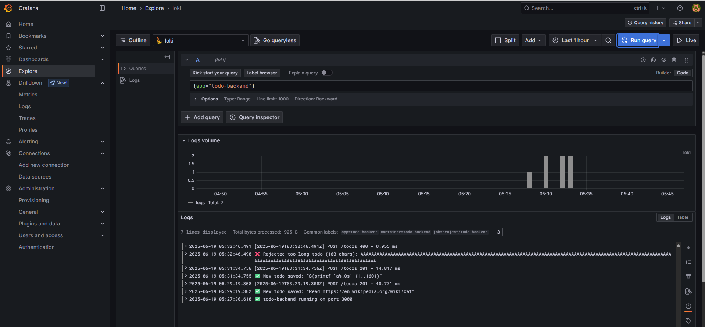

# Assignment

> The project could really use logging.
> 
> Add request logging so that you can monitor every *todo* that is sent to the backend.
> 
> Set the limit of 140 characters for todos into the backend as well. Use Postman or curl to test that too long todos are blocked by the backend and you can see the non-allowed messages in your Grafana.

# Solution

- Application was built in Nodejs, using `axum` crate. Additional logging was introduced for this exercise. A check was implemented for the length of the received TODO item on the `POST` endpoint. If the TODO is longer than 140 characters, the backend responds with HTTP code `400`:`Invalid request data`. 

## Commands

```bash
docker build -t bachthyaglx/todo-backend:latest ./todo-backend
docker push bachthyaglx/todo-backend:latest

kubectl rollout restart deployment todo-backend-dep -n project
kubectl get pods -n project
kubectl logs deploy/todo-backend-dep -n project
kubectl port-forward deploy/todo-backend-dep 3000:3000 -n project

kubectl create namespace prometheus
helm repo add prometheus-community https://prometheus-community.github.io/helm-charts
helm repo update
helm install prometheus-community/kube-prometheus-stack --generate-name --namespace prometheus

kubectl create namespace loki-stack
helm repo add grafana https://grafana.github.io/helm-charts
helm repo update
helm upgrade --install loki --namespace=loki-stack grafana/loki-stack --set loki.image.tag=2.9.3

kubectl -n prometheus port-forward svc/kube-prometheus-stack-grafana 3000:80

kubectl get svc -n prometheus
kubectl -n prometheus port-forward svc/kube-prometheus-stack-1750304357-grafana 3000:80
```

## Results

```bash
curl -X POST http://localhost:3000/todos -H "Content-Type: application/json" -d "{\"content\":\"Read https://en.wikipedia.org/wiki/Cat\"}"
{"message":"Created"}

curl -X POST http://localhost:3000/todos -H "Content-Type: application/json" -d "{\"content\":\"AAAAAAAAAAAAAAAAAAAAAAAAAAAAAAAAAAAAAAAAAAAAAAAAAAAAAAAAAAAAAAAAAAAAAAAAAAAAAAAAAAAAAAAAAAAAAAAAAAAAAAAAAAAAAAAAAAAAAAAAAAAAAAAAAAAAAAAAAAAAAAAAAAAAAAAAAAAAAAAA\"}"
{"error":"Todo must be under 140 characters"}
```

