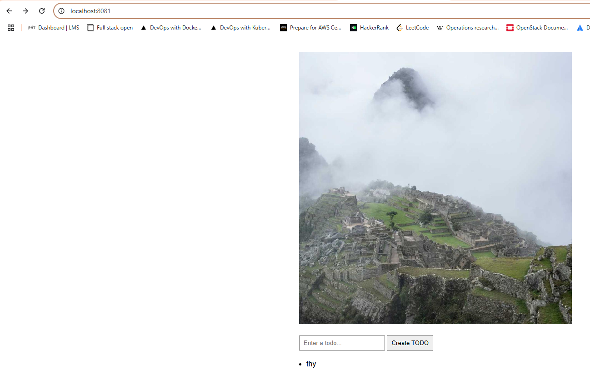
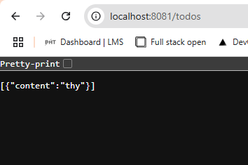

## Assignment

> 
> Let us get back to our Project. In the previous part we added a random pic and a form for creating todos to the app. The next step is to create a new container that takes care of saving the todo items.
> 
> This new service, let us call it todo-backend, should have a GET /todos endpoint for fetching the list of todos and a POST /todos endpoint for creating a new todo. The todos can be saved into memory, we'll add a database later.
> 
> Use ingress routing to enable access to the todo-backend.
> 
> After this exercise, the project should look like the following:
> 
> 
>
> The role of the service that we made in previous exercises (Todo-app in the figure) is to serve the HTML and possibly JavaScript to the browser. Also, the logic for serving random pictures and caching those remain in that service.
> 
> The new service then takes care of the todo items.
> 
> After this exercise, you should be able to create new todos using the form, and the created todos should be rendered in the browser.

## Solution

**Todo backend**

- Application was built in Rust, using `axum` crate. the application listens to port `3040`. It accepts `GET` and `POST` requests on `\todos` endpoint. Along with the todos, this application returns a url from image picsum to display in the frontend. The link changes every hour. 

**Todo app**

- Application was rebuilt from scratch using Rust `yew` crate to accomodate the need for a dynamic frontend. By default the application listens to port `3030`, unless `PORT` environment variable is provided. It communicates with the backend via `GET` and `POST` requests and displays the todos and an image to the user.

### Commands

```bash
docker build -t bachthyaglx/todo-backend:latest ./todo-backend
docker push bachthyaglx/todo-backend:latest
docker build -t bachthyaglx/todo-app:latest ./todo-app
docker push bachthyaglx/todo-app:latest

kubectl apply -f todo-backend/k8s/
kubectl apply -f todo-app/k8s/

kubectl get nodes # check k3d-mycluster-agent-0 for persistenceVolume.yaml
kubectl get pods,svc,ingress

# Troubleshootings
kubectl get pods
kubectl logs <pod>

kubectl rollout restart deployment todo-app-dep
kubectl rollout restart deployment todo-backend-dep
```

### Frontend



### Backend

