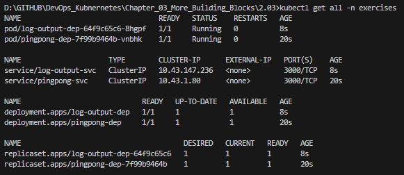
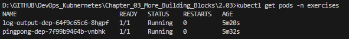
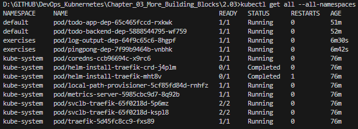

## Assignment

> Create a namespace for the applications in the exercises. Move the "Log output" and "Ping-pong" to that namespace and use that in the future for all of the exercises. You can follow the material in the default namespace.

## Solution

### Commands

```bash
kubectl create namespace exercises

# Delete the old resources from the default namespace
kubectl delete deployment pingpong-dep
kubectl delete service pingpong-svc
kubectl delete ingress pingpong-ingress

kubectl delete deployment log-output-dep
kubectl delete service log-output-svc
kubectl delete ingress log-output-ingress

# Re-apply Resources in the New Namespace
kubectl apply -f pingpong/k8s/
kubectl apply -f log-output/k8s/

# View resources in the exercises namespace
kubectl get all -n exercises
kubectl get pods -n exercises
kubectl get all --all-namespaces
```

### Tests





