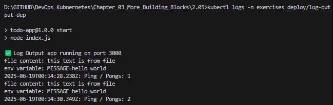

## Assignment

> In all future exercises if you are using an API key or a password, such as a database password, you will use Secrets. You can use `SOPS` to store it to a git repository. Never save unencrypted files into a git repository.
> 
> There's nothing specific to submit, all following submissions should follow the rule above.


### Commands

```bash
# Create the ConfigMap
kubectl apply -f log-output/k8s/log-output-configmap.yaml -n exercises

# Apply the Deployment (that uses the ConfigMap)
kubectl apply -f log-output/k8s/deployment.yaml -n exercises

# Restart the Pod to apply config updates
kubectl delete pod -n exercises -l app=log-output

# Verify from inside the container
kubectl exec -n exercises -it deploy/log-output-dep -- sh
echo $MESSAGE
cat /usr/src/app/config/information.txt

# Check application logs
kubectl logs -n exercises deploy/log-output-dep
```

### Results

