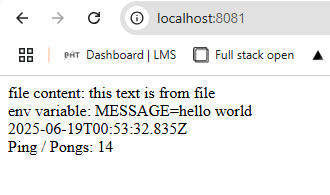
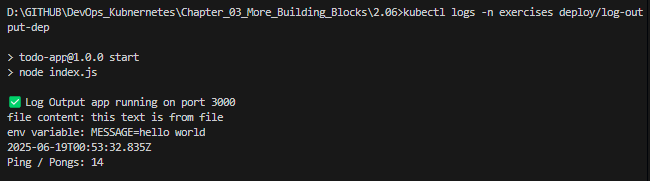

# Assignment

> Use the official Kubernetes documentation for this exercise.
> 
>   - https://kubernetes.io/docs/concepts/configuration/configmap/ and
>   - https://kubernetes.io/docs/tasks/configure-pod-container/configure-pod-configmap/
> 
> should contain everything you need.
> 
> Create a ConfigMap for the "Log output" application. The ConfigMap should define one file *information.txt* and one env variable *MESSAGE*.
> 
> The app should map the file as a volume, and set the environment variable and print the content of those besides the usual output:
> 
>       file content: this text is from file
>       env variable: MESSAGE=hello world
>       2024-03-30T12:15:17.705Z: 8523ecb1-c716-4cb6-a044-b9e83bb98e43.
>       Ping / Pongs: 3

### Commands

```bash
docker build --no-cache -t bachthyaglx/log-output:latest ./log-output
docker push bachthyaglx/log-output:latest
kubectl apply -f log-output/k8s/log-output-configmap.yaml -n exercises
kubectl apply -f log-output/k8s/deployment.yaml -n exercises
kubectl delete pod -n exercises -l app=log-output
kubectl logs -n exercises deploy/log-output-dep
```

### Results



