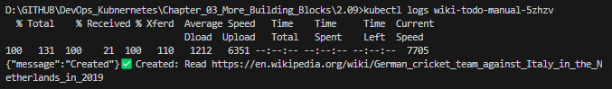
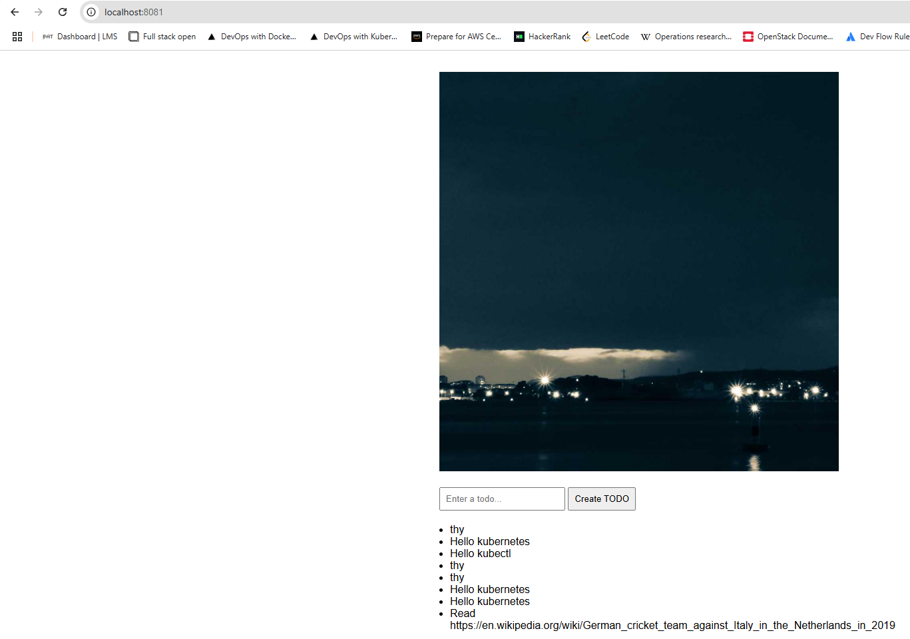

# Assignment

> Create a CronJob that generates a new todo every hour to remind you to do 'Read < URL >'.
> 
> Where < URL > is a Wikipedia article that was decided by the job randomly. It does not have to be a hyperlink, the user can copy-paste the URL from the todo.
> 
> https://en.wikipedia.org/wiki/Special:Random responds with a redirect to a random Wikipedia page so you can ask it to provide a random article for you to read. TIP: Check location header

# Solution

For the solution of this exercise a `ConfigMap` was created with a definition of a batch script to retrieve a random Wikiedia page and send a `POST` request with that page to `todo-backend-service` endpoint. The `ConfigMap` was then mounted as a volume in a `CronJob`.

## Commands

```bash
docker build -t bachthyaglx/wiki-todo-gen ./cronjob
docker push bachthyaglx/wiki-todo-gen
kubectl apply -f cronjob/cronjob.yaml -n project

kubectl get cronjob -n project
kubectl get jobs -n project
kubectl logs job/<job-name> -n project # wait the next 00:00 

# Manually add one and test
kubectl create job --from=cronjob/wiki-todo-cron wiki-todo-manual -n project
kubectl get pods -n project -l job-name=wiki-todo-manual
kubectl logs wiki-todo-manual-5zhzv
```

## Results




