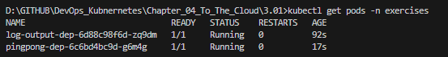
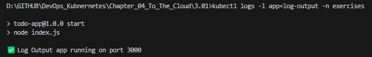
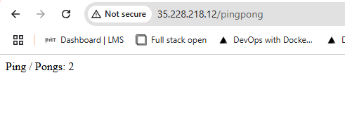
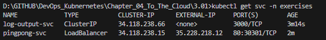

# Assignment

> Deploy Ping-pong application into GKE.
> 
> In this exercise use a LoadBalancer service to expose the service.
> 
> If your Postgres logs say
> 
>     initdb: error: directory "/var/lib/postgresql/data" exists but is not empty
>     It contains a lost+found directory, perhaps due to it being a mount point.
>     Using a mount point directly as the data directory is not recommended.
>     Create a subdirectory under the mount point.
> 
> you can add *subPath* configuration:
> 
> **statefulset.yaml**
> 
>     # ...
>     volumeMounts:
>     - name: data
>       mountPath: /var/lib/postgresql/data
>       subPath: postgres
>     # ...
>
> This will create a Postgres directory where the data will reside. subPaths also make it possible to use single volume for multiple purposes.

# Solution

### Commands

```bash
# Check to see local cluster is being used, not cloud cluster
kubectl config current-context

# Update image
docker build -t bachthyaglx/pingpong:latest ./pingpong
docker push bachthyaglx/pingpong:latest
docker build -t bachthyaglx/log-output:latest ./log-output
docker push bachthyaglx/log-output:latest

# Create new namespace=exercises for pingpong
kubectl apply -f pingpong/k8s/ -n exercises
kubectl apply -f log-output/k8s/ -n exercises
kubectl apply -f postgres/k8s/ -n exercises
kubectl apply -f log-output/k8s/log-output-configmap.yaml -n exercises
kubectl config set-context --current --namespace=exercises

# Restart
kubectl rollout restart deployment pingpong-dep -n exercises
kubectl rollout restart deployment log-output-dep -n exercises

# Verify
kubectl get pods -n exercises
kubectl logs -l app=log-output -n exercises
kubectl get svc -n exercises
kubectl logs deploy/pingpong-dep -n exercises
```

### Results








