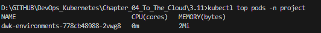

# Assignment

> Set sensible resource limits for the project. The exact values are not important. Test what works.

### Solution

```bash
kubectl apply -f postgres/k8s/stateful.yaml
kubectl apply -f todo-backend/k8s/deployment.yaml
kubectl apply -f todo-app/k8s/deployment.yaml

# Verify esources.requests and resources.limits
kubectl top pods -n project
```

### Results

