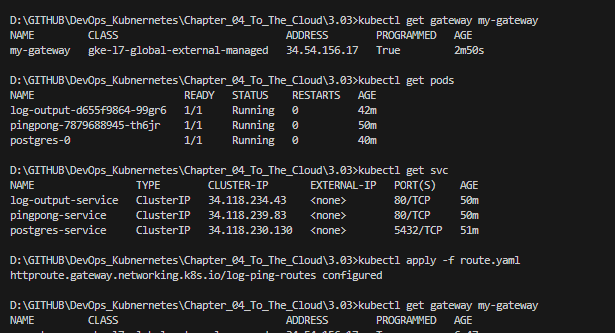
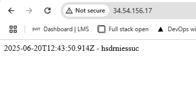
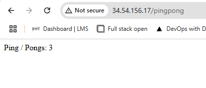

# Assignment

> Replace the Ingress with Gateway API. See here for more about HTTP routing.

# Solution

Replace traditional ingress by gatewayAPI. Remove share-ingress, create gateway + route

## Commands

```bash
kubectl delete -f shared-ingress.yaml

# Enable Gateway API on GKE (run 1 time only):
gcloud container clusters update dwk-cluster --zone=europe-west1-b --gateway-api=standard

# Apply changes
kubectl apply -f pingpong/k8s/service.yaml
kubectl apply -f log-output/k8s/service.yaml
kubectl apply -f gateway.yaml
kubectl apply -f route.yaml

# Verify
kubectl get gateway my-gateway
kubectl describe gateway my-gateway
```

## Frontend





