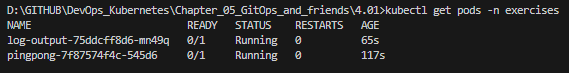
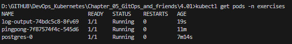

# Assignment

> Create a ReadinessProbe for the Ping-pong application. It should be ready when it has a connection to the database.
> 
> And another ReadinessProbe for Log output application. It should be ready when it can receive data from the Ping-pong application.
> 
> Test that it works by applying everything but the database statefulset. The output of `kubectl get po` should look like this before the database is available:
> 
>     NAME                             READY   STATUS    RESTARTS   AGE
>     logoutput-dep-7f49547cf4-ttj4f   1/2     Running   0          21s
>     pingpong-dep-9b698d6fb-jdgq9     0/1     Running   0          21s
> Adding the database should automatically move the READY states to 2/2 and 1/1 for Log output and Ping-pong respectively.

### Solution

```bash
docker build -t bachthyaglx/pingpong:latest ./pingpong
docker push bachthyaglx/pingpong:latest

docker build -t bachthyaglx/log-output:latest ./log-output
docker push bachthyaglx/log-output:latest

# Create ns (if not yet)
kubectl create ns exercises

# Deploy Pingpong, Log-output
kubectl apply -f pingpong/k8s/
kubectl apply -f log-output/k8s/

# Apply shared ingress
kubectl apply -f shared-ingress.yaml

# Create secret containing DATABASE_URL
kubectl apply -f postgres/k8s/secret.yaml

# Deploy PostgreSQL database
kubectl apply -f postgres/k8s/service.yaml
kubectl apply -f postgres/k8s/statefulset.yaml
```

### Results

Check pod status when there is no database
Reason: pingpong cannot connect to DB → /healthz returns 500 → Pod is not ready.



Check pod status after deploy PostgreSQL database → Pod is ready.

