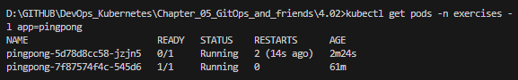
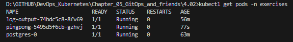

# Assignment

> Create the required probes and endpoint for The Project to ensure that it's working and connected to a database.
> 
> Test that the probe indeed works with a version without database access, for example by supplying a wrong database URL or credentials.

### Solution

```bash
kubectl apply -f postgres/k8s/secret.yaml
kubectl rollout restart deployment pingpong -n exercises
kubectl get pods -n exercises
```

### Results

Test with wrong database configuration /postgres/k8s/secret.yaml password: mysecretpassword -> wrongpass



Test with correct db 

