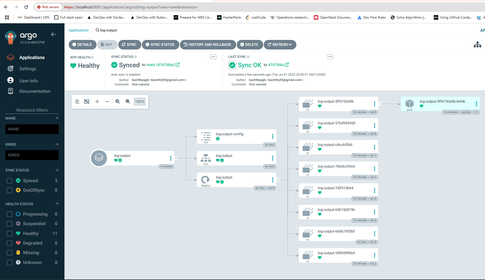
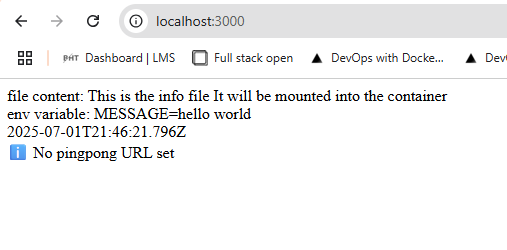

# Assignment

> Move the Ping-pong application to use GitOps so that when you commit to the repository, the application is automatically updated.

# Commands

```bash
kubectl apply -f log-output-argocd-app.yaml
kubectl apply -f manifests/

kubectl port-forward pod/log-output-5ff475cb9b-khhlk 3000:3000
kubectl port-forward svc/argocd-server -n argocd 8081:443
```

## Results



