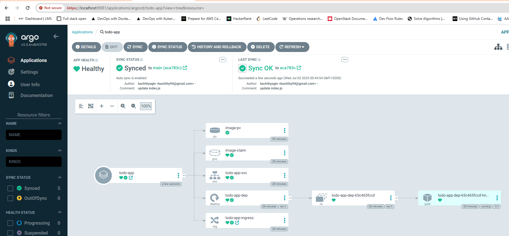
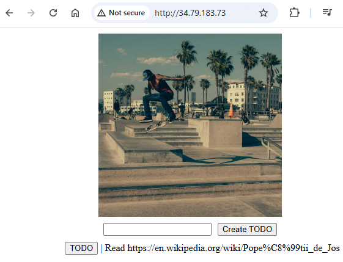

# Assignment

> Move the project to use GitOps so that when you commit to the repository, the application is automatically updated. In this exercise, it is enough that the main branch is deployed to cluster.

# Commands

```bash

kubectl port-forward pod/log-output-5ff475cb9b-khhlk 3000:3000
kubectl port-forward svc/argocd-server -n argocd 8081:443
```

## Results




