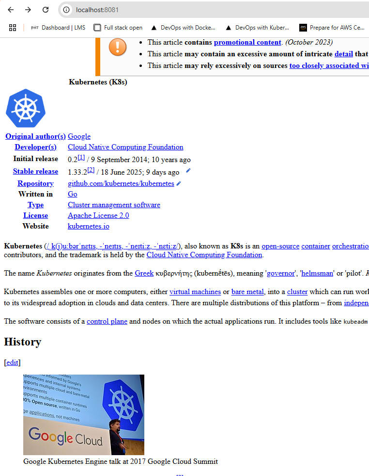

# Assignment

> Write an app that serves Wikipedia pages. The app should contain

> * The main container based on nginx image, that just serves whatever content it has in the public www location
init container that curls page [https://en.wikipedia.org/wiki/Kubernetes](https://en.wikipedia.org/wiki/Kubernetes) and saves the page content to the public www directory for the main container.
> * A sidecar container that waits for a random time between 5 and 15 minutes, curls for a random Wikipedia page in URL [https://en.wikipedia.org/wiki/Special:Random](https://en.wikipedia.org/wiki/Special:Random) and saves the page content to the public www directory for the main container.

> Hint: you might need to refresh your memory by reading [this](https://courses.mooc.fi/org/uh-cs/courses/devops-with-kubernetes/chapter-2/introduction-to-storage) from Chapter 2 of the course.

### Commands

```bash
kubectl delete pod wikipedia
kubectl apply -f wikipedia-pod.yaml
kubectl port-forward pod/wikipedia 8081:80

# Visit to show the Kubernetes page
http://localhost:8080/
http://localhost:8080/random.html ## After 5s will show random content from Wikipedia

```

### Results



After 5s, http://localhost:8080/random.html will show random content from Wikipedia


