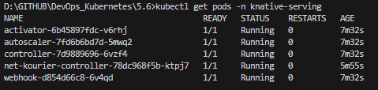
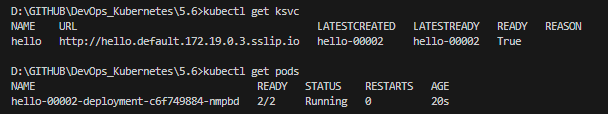
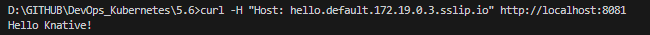

# Assignment

> Install Knative Serving component to your k3d cluster.

> For Knative to work locally in k3d you need to create it a cluster without Traefik:

> ```bash
> $ k3d cluster create --port 8082:30080@agent:0 -p 8081:80@loadbalancer --agents 2 --k3s-arg "--disable=traefik@server:0"
> ```

> Follow then [this](https://knative.dev/docs/install/yaml-install/serving/install-serving-with-yaml/) guide. In section Configure DNS section, pick Magic DNS (slip.io)

> You might end up in a situation like this in the step verify the installation:

> ```bash
> $ kubectl get pods -n knative-serving
> NAME                                      READY   STATUS             RESTARTS      AGE
> activator-67855958d-w2ws8                 0/1     Running            0             64s
> autoscaler-5ff4c5d679-54l28               0/1     Running            0             64s
> webhook-5446675b97-2ngh6                  0/1     CrashLoopBackOff   3 (12s ago)   64s
> net-kourier-controller-58b6bf4fbc-g7dlp   0/1     CrashLoopBackOff   3 (10s ago)   55s
> controller-6d8b579f9-p42dx                0/1     CrashLoopBackOff   3 (6s ago)    64s
> ```

> See the logs of a crashing pod to see how to fix the problem.

> Next, try out the examples in [Deploying a Knative Service](https://knative.dev/docs/getting-started/first-service/), [Autoscaling](https://knative.dev/docs/getting-started/first-autoscale/) and [Traffic splitting](https://knative.dev/docs/getting-started/first-traffic-split/).

> Note you can access the service from the host machine as follows:
>```bash
> curl -H "Host: hello.default.192.168.240.3.sslip.io" http://localhost:8081
>```

> Where Host is the URL you get with the following command:
> ```bash
> kubectl get ksvc
> ```

### Commands

```bash
# Create a k3d Cluster without Traefik
k3d cluster create knative-cluster --port 8082:30080@agent:0 -p 8081:80@loadbalancer --agents 2 --k3s-arg "--disable=traefik@server:0"

# Add required CRDs
kubectl apply -f https://github.com/knative/serving/releases/download/knative-v1.13.2/serving-crds.yaml

# Install core Knative Serving
kubectl apply -f https://github.com/knative/serving/releases/download/knative-v1.13.2/serving-core.yaml

# Install Kourier as networking layer
kubectl apply -f https://github.com/knative/net-kourier/releases/download/knative-v1.13.0/kourier.yaml

# Configure Knative to use Kourier
kubectl patch configmap/config-network -n knative-serving --type merge -p "{\"data\":{\"ingress.class\":\"kourier.ingress.networking.knative.dev\"}}"

# Configure DNS using Magic DNS (sslip.io)
kubectl -n kourier-system get svc kourier

# Find the EXTERNAL-IP (e.g. 192.168.240.3) and set:
set DOMAIN=172.19.0.3.sslip.io
kubectl patch configmap/config-domain --namespace knative-serving --type merge --patch "{\"data\": {\"172.19.0.3.sslip.io\": \"\"}}"

# Deploy Example Knative Service
kubectl apply -f hello.yaml
kubectl get ksvc
kubectl get ksvc hello -o jsonpath='{.status.url}'
curl -H "Host: hello.default.172.19.0.3.sslip.io" http://localhost:8081
```

### Results





