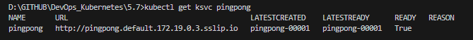

# Assignment

> Make the Ping-pong application serverless.

> Reading [this](http://knative.dev/docs/serving/convert-deployment-to-knative-service/) might be helpful.

> TIP: Your application should listen on port 8080 or better yet have a PORT environment variable to configure this.


### Commands
```bash
docker build -t bachthyaglx/pingpong-serverless .
docker push bachthyaglx/pingpong-serverless
kubectl apply -f knative-pingpong.yaml
kubectl get ksvc pingpong
curl -H "Host: pingpong.default.172.19.0.3.sslip.io" http://localhost:8081/pingpong
```

### Results


