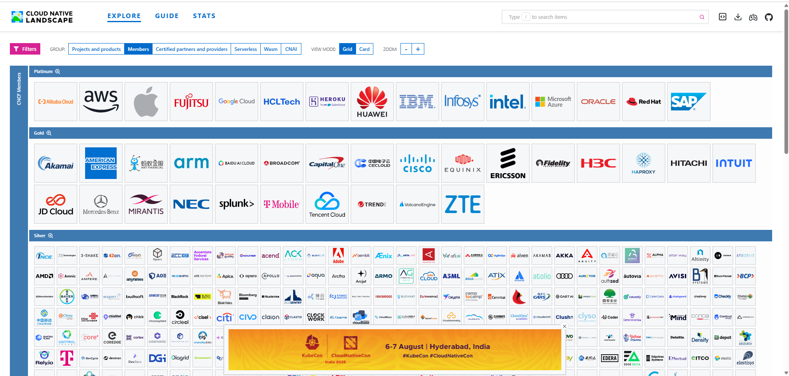

# Assignment

> Make the Ping-pong application serverless.

> Reading [this](http://knative.dev/docs/serving/convert-deployment-to-knative-service/) might be helpful.

> TIP: Your application should listen on port 8080 or better yet have a PORT environment variable to configure this.

### 🟢 Directly Used

- **Helm**: Used to install NATS in Part 5.3.
- **Istio**: Used in ambient mode to split traffic between Greeter v1 and v2 in 5.3.
- **Knative**: Used in Part 5.6 and 5.7 to deploy serverless services (hello + pingpong).
- **k3d**: Used to run local Kubernetes cluster throughout Part 5.
- **kubectl**: Used as the main CLI for managing Kubernetes resources.
- **Prometheus**: Used via Helm installation for monitoring.
- **Docker**: Used to build and push images (e.g. todo-backend, pingpong app).
- **GitHub**: Used for storing project repositories and pushing updates.

### 🟡 Indirectly Used

- **containerd**: Used internally by k3s/k3d for managing containers.
- **Flannel**: Used as the default CNI by k3s (thus indirectly used via k3d).
- **etcd**: Used as Kubernetes' backing store (indirectly via k3d/k3s).
- **CoreDNS**: Used for internal DNS resolution in the cluster.
- **Envoy**: Used by Istio to route and manage traffic.
- **OpenTelemetry**: (optional, if metrics were integrated during observability)
- **cAdvisor**: Used internally by kubelet to collect metrics.

### 🌍 Outside of the Course

- **Grafana**: Used previously to visualize metrics from Prometheus.
- **ArgoCD**: Used in a personal project for GitOps-based Kubernetes deployment.
- **MinIO**: Used in a personal real-time analytics project as S3-compatible storage.

