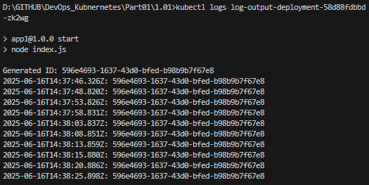

## Assignment

> 
> **Exercises can be done with any language and framework you want.**
> 
> Create an application that generates a random string on startup, stores this string into memory, and outputs it every 5 seconds with a timestamp. e.g.
> 
>       2020-03-30T12:15:17.705Z: 8523ecb1-c716-4cb6-a044-b9e83bb98e43   
>       2020-03-30T12:15:22.705Z: 8523ecb1-c716-4cb6-a044-b9e83bb98e43
> 
> Deploy it into your Kubernetes cluster and confirm that it's running with `kubectl logs ...`
> 
> You will keep building this application in the future exercises. This application will be called "Log output".

## Solution

The following commands were used to create and test Kubernetes deployment:
```bash
k3d cluster create -a 2 # create a server node with 2 agent nodes, default name: k3s-default
docker build -t todo-server:local . # create docker image
k3d image import log-output:local -c k3s-default #  Import image into your k3d cluster
kubectl apply -f manifests/deployment.yaml # Apply the deployment
```

Deployment for Exercise 1.01


