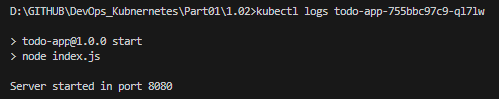

## Assignment

> 
> **Project can be done with any language and framework you want**
> 
> The project will be a simple todo application with the familiar features of create, read, update, and delete (CRUD). We'll develop it during all parts of this course. Check the title of the exercise for "Project vX.Y" to know it is about building the project.
> 
> Todo is a text like "I need to clean the house" that can be in state of not-done or done.
> 
> 
> 
> Dashed lines separate major differences across the course. Some exercises are not included in the picture. The connections between most pods are not included as well. You are free to do them however you want.
> 
> Keep this in mind if you want to avoid doing more work than necessary.
> 
> Let's get started!
> 
> Create a web server that outputs "Server started in port NNNN" when it is started and deploy it into your Kubernetes cluster. Please make it so that an environment variable PORT can be used to choose that port. You will not have access to the port when it is running in Kubernetes yet. We will configure the access when we get to networking.

## Solution

The following commands were used to create and test Kubernetes deployment:

```bash
k3d cluster create -a 2 # create k3s-default cluster
docker build -t todo-server:local . # create docker image
k3d image import todo-server:local -c k3s-default # import image to cluster k3s-default
kubectl apply -f manifests/deployment.yaml # apply/deploy app to kube cluster k3s-default
```

Deployment for Exercise 1.02

