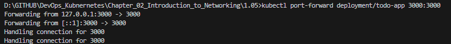

## Assignment

> 
> Have the project respond something to a GET request sent to the project. A simple html page is good or you can deploy something more complex like a single-page-application.
> 
> See [here](https://kubernetes.io/docs/tasks/inject-data-application/define-environment-variable-container/) how you can define environment variables for containers.
> 
> Use `kubectl port-forward` to confirm that the project is accessible and works in the cluster by using a browser to access the project.

## Solution
The following commands were used to create and test Kubernetes deployment:

```bash
k3d cluster create -a 2 # create k3s-default cluster
docker build -t todo-server:local . # create docker image
k3d image import todo-server:local -c k3s-default # import image to cluster k3s-default
kubectl apply -f manifests/deployment.yaml # apply/deploy app to kube cluster k3s-default
kubectl port-forward deployment/todo-app 3000:3000 # forward a local port to a pod
```

