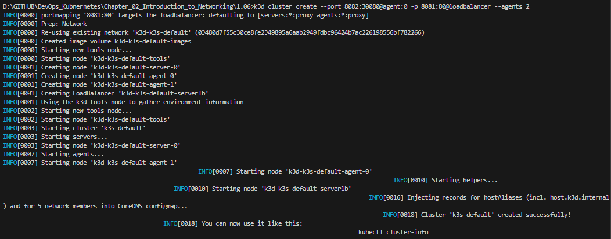
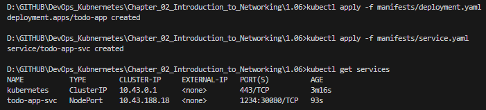

## Assignment

> 
> Use a NodePort Service to enable access to the project.

## Solution

### Service Manifest

```
apiVersion: v1
kind: Service
metadata:
  name: todo-app-service
spec:
  type: NodePort
  selector:
    app: todo-app
  ports:
    - name: http
      nodePort: 30088
      protocol: TCP
      port: 1234
      targetPort: 8088
```

### Commands

```bash
k3d cluster create --port 8082:30080@agent:0 -p 8081:80@loadbalancer --agents 2
kubectl apply -f manifests/deployment.yaml
kubectl apply -f manifests/service.yaml
kubectl port-forward deployment/todo-app 8088:8088
```



