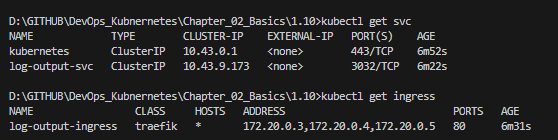

## Assignment

> 
> Split the "Log output" application into two different containers within a single pod:
> 
> One generates a new timestamp every 5 seconds and saves it into a file.
> 
> The other reads that file and outputs it with a hash for the user to see.
> 
> Either application can generate the hash. The reader or the writer.
> 
> You may find [this](https://kubernetes.io/docs/reference/kubectl/generated/kubectl_logs/) helpful now since there are more than one container running inside a pod.

## Solution

Application was built in Rust. It listens for a GET request on `localhost:8081/`.  

[**Deployment**](https://github.com/VikSil/DevOps_with_Kubernetes/tree/trunk/Part1/Exercise_1.10/manifests/deployment.yaml)

```
apiVersion: apps/v1
kind: Deployment
metadata:
  name: log-output
spec:
  replicas: 1
  selector:
    matchLabels:
      app: log-output
  template:
    metadata:
      labels:
        app: log-output
    spec:
      volumes: # Define volume
        - name: shared-logs
          emptyDir: {}
      containers:
        - name: log-writer
          image: bachthyaglx/log-writer:v1
          volumeMounts: # Mount volume
            - name: shared-logs
              mountPath: /usr/src/app/data
        - name: log-reader
          image: bachthyaglx/log-reader:v1
          volumeMounts: # Mount volume
            - name: shared-logs
              mountPath: /usr/src/app/data
```

[**Service**](https://github.com/VikSil/DevOps_with_Kubernetes/tree/trunk/Part1/Exercise_1.07/manifests/service.yaml)

Unchanged service manifest from [Exercise 1.07](https://github.com/VikSil/DevOps_with_Kubernetes/tree/trunk/Part1/Exercise_1.07) was used.

[**Ingress**](https://github.com/VikSil/DevOps_with_Kubernetes/tree/trunk/Part1/Exercise_1.07/manifests/Ingress.yaml)

Unchanged ingress manifest from [Exercise 1.07](https://github.com/VikSil/DevOps_with_Kubernetes/tree/trunk/Part1/Exercise_1.07) was used. 

### Commands

```bash
k3d cluster create --port 8082:30080@agent:0 -p 8081:80@loadbalancer --agents 2
docker build -t bachthyaglx/log-writer:v1 ./log-writer
docker build -t bachthyaglx/log-reader:v1 ./log-reader
docker push bachthyaglx/log-writer:v1
docker push bachthyaglx/log-reader:v1
kubectl apply -f manifests/
kubectl get pods
kubectl get svc
kubectl get ingress
```

### GET Request 


