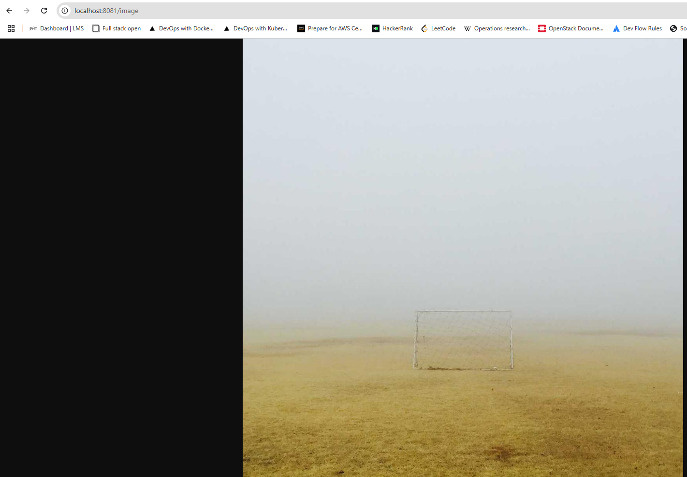

## Assignment

> 
> Since the project looks a bit boring right now, let's add a picture!
> 
> The goal is to add an hourly image to the project.
> 
> Get a random picture from Lorem Picsum like `https://picsum.photos/1200` and display it in the project. Find a way to store the image so it stays the same for 60 minutes.
> 
> Make sure to cache the image into a volume so that the API isn't needed for new images every time we access the application or the container crashes.
> 
> The best way to test what happens when your container shuts down is likely by shutting down the container, so you can add logic for that as well, for testing purposes.

## Solution

Application was built in Rust. By default the application listens to port 3030, if no `PORT` environment variable is provided. It returns an HTML age with a single random image downloaded from `https://picsum.photos/1200`. By default the image is replaced every hour, but it is possible to specify an environemnt variable `TIMEOUT` (in seconds) to specify how frequently a new picture should be returned. 

[**Deployment**](https://github.com/VikSil/DevOps_with_Kubernetes/tree/trunk/Part1/Exercise_1.12/manifests/deployment.yaml)

```
apiVersion: apps/v1
kind: Deployment
metadata:
  name: image-cache
spec:
  replicas: 1
  selector:
    matchLabels:
      app: image-cache
  template:
    metadata:
      labels:
        app: image-cache
    spec:
      volumes:
        - name: shared-image
          persistentVolumeClaim:
            claimName: image-claim
      containers:
        - name: image-cache-container
          image: bachthyaglx/image-cache:latest
          ports:
            - containerPort: 3000
          volumeMounts:
            - name: shared-image
              mountPath: /usr/src/app/data
```

[**Service**](https://github.com/VikSil/DevOps_with_Kubernetes/tree/trunk/Part1/Exercise_1.08/manifests/service.yaml)

```bash
apiVersion: v1
kind: Service
metadata:
  name: image-cache-svc
spec:
  selector:
    app: image-cache
  ports:
    - port: 80
      targetPort: 3000
```

[**Ingress**](https://github.com/VikSil/DevOps_with_Kubernetes/tree/trunk/Part1/Exercise_1.08/manifests/ingress.yaml)

```bash
apiVersion: networking.k8s.io/v1
kind: Ingress
metadata:
  name: image-cache-ingress
  annotations:
    traefik.ingress.kubernetes.io/router.entrypoints: web
spec:
  ingressClassName: traefik
  rules:
    - http:
        paths:
          - path: /image
            pathType: Prefix
            backend:
              service:
                name: image-cache-svc
                port:
                  number: 80
```

[**Persistent Volume**](https://github.com/VikSil/DevOps_with_Kubernetes/tree/trunk/Part1/Exercise_1.12/volumes/persistentvolume.yaml)

```bash
apiVersion: v1
kind: PersistentVolume
metadata:
  name: example-pv
spec:
  storageClassName: my-example-pv # this is the name you are using later to claim this volume
  capacity:
    storage: 1Gi # Could be e.q. 500Gi. Small amount is to preserve space when testing locally
  volumeMode: Filesystem # This declares that it will be mounted into pods as a directory
  accessModes:
    - ReadWriteOnce
  local:
    path: /tmp/kube
  nodeAffinity: ## This is only required for local, it defines which nodes can access it
    required:
      nodeSelectorTerms:
        - matchExpressions:
            - key: kubernetes.io/hostname
              operator: In
              values:
                - k3d-mycluster-agent-0 # This is the name of the node where the volume is located, change it to your node name
```

[**Persistent Volume Claim**](https://github.com/VikSil/DevOps_with_Kubernetes/tree/trunk/Part1/Exercise_1.12/volumes/persistentvolumeclaim.yaml)

Persistent Volume Claim manifest from [Exercise 1.11](https://github.com/VikSil/DevOps_with_Kubernetes/tree/trunk/Part1/Exercise_1.11) was used, with only the `metadata name` and `storageClassName` changed to *todo_app*:

```bash
apiVersion: v1
kind: PersistentVolumeClaim
metadata:
  name: image-claim # name of the volume claim, this will be used in the deployment
spec:
  storageClassName: my-example-pv # this is the name of the persistent volume we are claiming
  accessModes:
    - ReadWriteOnce
  resources:
    requests:
      storage: 1Gi
```

### Commands

```bash
docker build -t bachthyaglx/project-app:v1 .
docker push bachthyaglx/project-app:v1

docker exec k3d-log-cluster-agent-0 mkdir -p /tmp/kube/project-cache
kubectl apply -f manifests/
```

### Webpage

