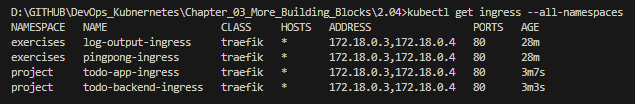
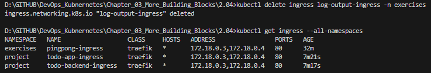

## Assignment

> Create a namespace for the project and move everything related to the project to that namespace.

## Solution

### Commands

```bash
kubectl create namespace project

kubectl delete deployment todo-app-dep
kubectl delete service todo-app-svc
kubectl delete ingress todo-app-ingress
kubectl delete pvc image-claim
kubectl delete pv example-pv

kubectl delete deployment todo-backend-dep
kubectl delete service todo-backend-svc
kubectl delete ingress todo-backend-ingress

kubectl apply -f todo-app/k8s/
kubectl apply -f todo-backend/k8s/

kubectl get all -n project

# Remove the Conflicting / Ingress from log-output
kubectl delete ingress log-output-ingress -n exercises
```

### Tests





