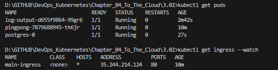
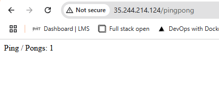
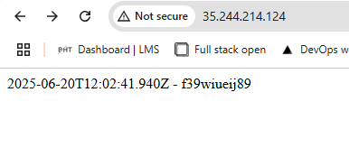

# Assignment

> Deploy the "Log output" and "Ping-pong" applications into GKE and expose it with Ingress.
> 
> "Ping-pong" will have to respond from /pingpong path. This may require you to rewrite parts of the code.
> 
> Note that Ingress expects a service to give a successful response in the path / even if the service is mapped to some other path!
> 

# Solution

Application was modified by adding a `/` route that responds to `GET` requests with HTML response code `200`:`OK` and outputs a log line to `stdout`. The number of pings/pongs are still returned on `/pingpong` endpoint. 

## Commands

```bash
gcloud projects list
gcloud container clusters list
gcloud config set project pingpong-463502
gcloud container clusters create dwk-cluster --zone=europe-west1-b --num-nodes=1 --enable-ip-alias --project=pingpong-463502
gcloud container clusters get-credentials dwk-cluster --zone=europe-west1-b

kubectl get nodes
kubectl create namespace pingpong
kubectl config set-context --current --namespace=pingpong

docker build -t bachthyaglx/pingpong:latest ./pingpong
docker build -t bachthyaglx/log-output:latest ./log-output
docker push bachthyaglx/pingpong:latest 
docker push bachthyaglx/log-output:latest 

kubectl apply -f postgres/k8s/ -n pingpong
kubectl apply -f log-output/k8s/ -n pingpong
kubectl apply -f pingpong/k8s/ -n pingpong
kubectl apply -f shared-ingress.yaml -n pingpong

kubectl get pods
kubectl get ingress --watch
```

## Results





