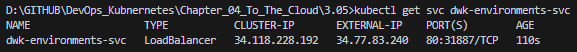
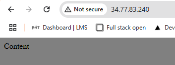

# Assignment

> Configure the project to use Kustomize, and deploy it to Google Kubernetes Engine.

# Solution

In order for a github action to be triggered when a branch in a repo is deleted the following `.yaml` file has to be placed in `.github/workflows` directory in the main branch. Placing the action in the branch that will be deleted does nothing, since the action will be deleted with the branch. There is no need to check which branch is being deleted, since it is not possible to delete the default (main) branch in git. 

## Commands

```bash
kubectl apply -k .
kubectl kustomize .

get svc dwk-environments-svc
```

## Results





