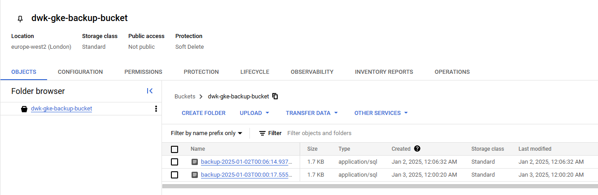

# Assignment

> Deploy Ping-pong application into GKE.
> 
> In this exercise use a LoadBalancer service to expose the service.
> 
> If your Postgres logs say
> 
>     initdb: error: directory "/var/lib/postgresql/data" exists but is not empty
>     It contains a lost+found directory, perhaps due to it being a mount point.
>     Using a mount point directly as the data directory is not recommended.
>     Create a subdirectory under the mount point.
> 
> you can add *subPath* configuration:
> 
> **statefulset.yaml**
> 
>     # ...
>     volumeMounts:
>     - name: data
>       mountPath: /var/lib/postgresql/data
>       subPath: postgres
>     # ...
>
> This will create a Postgres directory where the data will reside. subPaths also make it possible to use single volume for multiple purposes.

# Solution

### Commands

```bash
kubectl apply -k todo-app/k8s/

# Check existing GCS bucket
gcloud storage buckets list
# If you don't have a bucket, create one with:
gcloud storage buckets create gs://todo-backup-bkt --location=europe-west1
# Create Service Account (if not already present):
gcloud iam service-accounts create pg-backup --description="Service account for pg_dump backups" --display-name="Postgres Backup SA"
# Assign permissions to the service account:
gcloud iam service-accounts create pg-backup --project=forward-logic-407611 --description="Service account for PostgreSQL backups" --display-name="PostgreSQL Backup"
gcloud projects add-iam-policy-binding forward-logic-407611 --member="serviceAccount:pg-backup@YOUR_PROJECT_ID.iam.gserviceaccount.com" --role="roles/storage.objectAdmin"
gcloud iam service-accounts keys create key.json --iam-account=pg-backup@forward-logic-407611.iam.gserviceaccount.com

kubectl create secret generic gcs-sa-secret --from-file=key.json=./key.json -n project
kubectl create job --from=cronjob/db-backup-cronjob manual-db-backup -n project

kubectl apply -f cronjob/db-backup-cronjob.yaml

set GOOGLE_APPLICATION_CREDENTIALS=key.json
gsutil cp test-file.sql gs://todo-backup-bkt/

```

### Results

