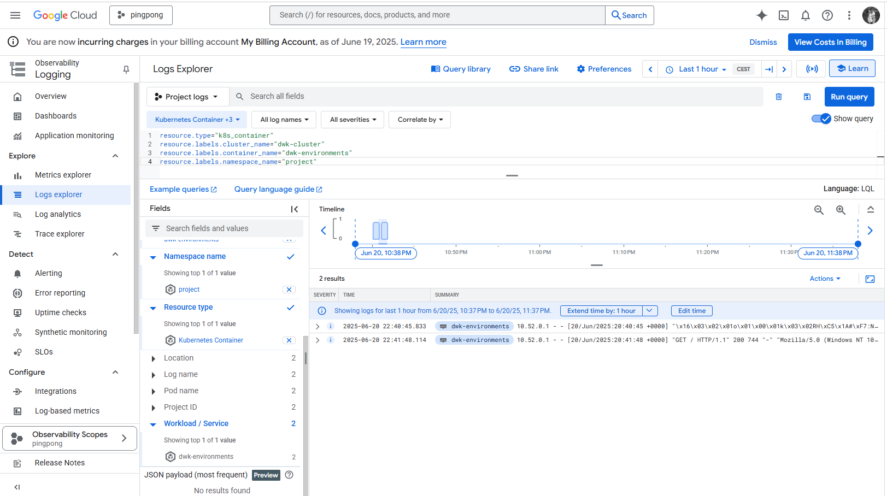

# Assignment

> GKE includes monitoring systems already so we can just enable the monitoring.
> 
> Read documentation for Kubernetes Engine Monitoring [here](https://cloud.google.com/kubernetes-engine/docs/concepts/observability) and setup logging for the project in GKE.
> 
> You can optionally include Prometheus as well.
> 
> Submit a picture of the logs when a new todo is created.

# Solution

```bash
Step 1: Open Cloud Operations (Monitoring + Logging)
Go to: https://console.cloud.google.com/kubernetes
Select the cluster dwk-cluster (or your cluster).
In the left sidebar, open Observability → Logs.
If there is a message "Enable Cloud Logging / Monitoring", click “Enable” (GKE has built-in agent, you just need to enable it).

Step 2: Submit a new Todo
Create a new todo to generate logs:
curl -X POST http://<your-external-ip>/todos -H "Content-Type: application/json" -d '{"content": "This is a log test"}'
Or create it directly from the todo-app interface.

Step 3: Open Logs Explorer to find the log
Go to Logs Explorer
Select:
Resource: Kubernetes Container
Namespace: project
Pod: todo-backend-dep-...
Filter by the most recent time and find the log line like:
✅ todo-backend running on port 3000
```

