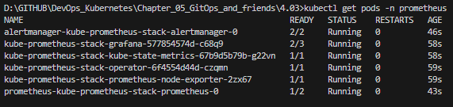
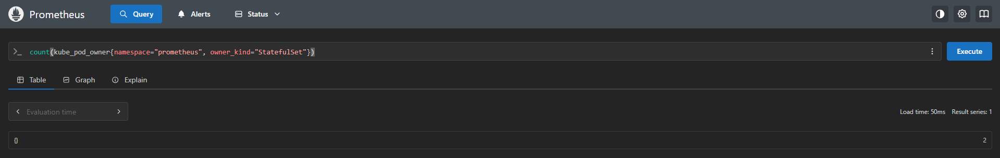

# Assignment

> Ok, we started up Prometheus in part 2, but we have barely scratched the surface. Let's do a single hands-on query to learn more.
> 
> Start now Prometheus with Helm and use port-forward to access the GUI website. Port 9090 is the default for Prometheus:
> 
>      $ kubectl -n prometheus get pods
>       NAME                                                              READY   STATUS    RESTARTS   AGE
>        alertmanager-kube-prometheus-stack-1714-alertmanager-0            2/2     Running   0          3h19m
>        kube-prometheus-stack-1714-operator-94c596dbd-n5pcl               1/1     Running   0          3h19m
>        kube-prometheus-stack-1714644114-grafana-54cbbc4c46-m26f6         3/3     Running   0          3h19m
>        kube-prometheus-stack-1714644114-kube-state-metrics-7cb796tpjbd   1/1     Running   0          3h19m
>        kube-prometheus-stack-1714644114-prometheus-node-exporter-kdpln   1/1     Running   0          3h19m
>        kube-prometheus-stack-1714644114-prometheus-node-exporter-sp9pg   1/1     Running   0          3h19m
>        kube-prometheus-stack-1714644114-prometheus-node-exporter-vbbjk   1/1     Running   0          3h19m
>        prometheus-kube-prometheus-stack-1714-prometheus-0                2/2     Running   0          3h19m
>        
>        $ kubectl -n prometheus port-forward prometheus-kube-prometheus-stack-1714-prometheus-0 9090:9090
>        Forwarding from 127.0.0.1:9090 -> 9090
>        Forwarding from [::1]:9090 -> 9090
>
> And now accessing http://localhost:9090 will allow us to write queries.
> 
> **Write a query** that shows the number of pods created by StatefulSets in *prometheus* namespace. For the above setup the *Value* should be 3 different pods:
> 
> 
>
> Query for "kube_pod_info" should have the required fields to filter through. See [documentation](https://prometheus.io/docs/prometheus/latest/querying/basics/) for help with querying.

### Prometheus meaning

> Prometheus understands Kubernetes architecture: pod, service, deployment, statefulset, node,...
> Is the default monitoring tool in many Helm Charts or Kubernetes operators.
> Helps you know if the application is running smoothly, is consuming CPU/RAM, or has DB connection errors..
> Combined with Alertmanager → automatic warning when there is a problem
> Observing resource usage charts helps you scale the right number of pods or nodes.
> Find bottlenecks and remove code/services that slow down the system.
> Grafana uses Prometheus as a data source to draw dashboards.
> Argo Rollouts uses Prometheus to check the health of new releases.
> Kiali and Istio also use Prometheus to analyze service mesh network traffic.

### Solution

```bash
helm repo add prometheus-community https://prometheus-community.github.io/helm-charts
helm repo update
kubectl create namespace prometheus
helm install kube-prometheus-stack prometheus-community/kube-prometheus-stack --namespace prometheus
kubectl get pods -n prometheus

kubectl -n prometheus port-forward prometheus-kube-prometheus-stack-prometheus-0 9090:9090
curl http://localhost:9090
count(kube_pod_owner{namespace="prometheus", owner_kind="StatefulSet"})
```

### Results



