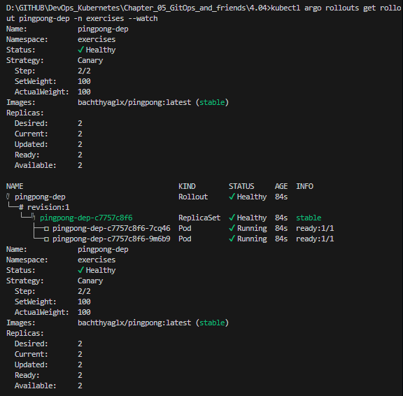

# Assignment

> Create an AnalysisTemplate for The Project that will follow the CPU usage of all containers in the namespace.
> 
> If the CPU usage **rate** sum for the namespace increases above a set value (you may choose a good hardcoded value for your project) within 10 minutes, revert the update.
> 
> Make sure that the application doesn't get updated, if the value is set too low.

### Solutions

> Traditional Deployment: will update all pods, errors occur on all users → downtime, manual rollback.
> Rollout: only 25% of pods are affected first. If errors occur, the system automatically rolls back → almost no impact on real users.
> If you're doing production or CI/CD, Argo Rollouts is a much safer, smarter, and more modern deployment upgrade solution than regular Deployments.

### Commands

```bash
docker build -t bachthyglx/pingpong:latest ./pingpong
docker push bachthyaglx/pingpong:latest

kubectl delete deployment pingpong -n exercises
kubectl create namespace argo-rollouts
kubectl apply -n argo-rollouts -f https://github.com/argoproj/argo-rollouts/releases/latest/download/install.yaml
kubectl apply -f pingpong/k8s/analysistemplate-pingpong-cpu.yaml -n exercises
kubectl apply -f pingpong/k8s/rollout.yaml -n exercises
kubectl argo rollouts get rollout pingpong-dep --namespace=exercises --watch
```

### Results

