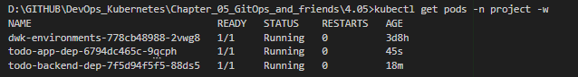
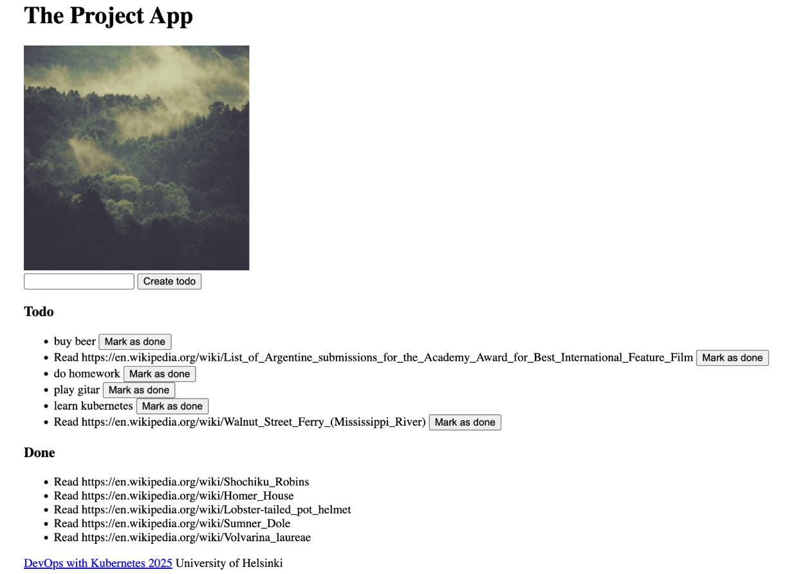

# Assignment

> Speaking of updating. Our todo application could use "Done" field for todos that are already done. It should be a PUT request to `/todos/<id>`.

# Solution

```bash
docker build -t bachthyaglx/todo-backend:latest ./todo-backend
docker build -t bachthyaglx/todo-app:latest ./todo-app
docker push bachthyaglx/todo-backend:latest
docker push bachthyaglx/todo-app:latest

kubectl delete pvc image-claim -n project
kubectl delete pv example-pv
kubectl apply -f todo-app/k8s/persistenceVolume.yaml
kubectl apply -f todo-app/k8s/persistenceVolumeClaim.yaml

kubectl delete pod -l app=todo-app -n project
kubectl delete pod -l app=todo-backend -n project

kubectl apply -f todo-backend/k8s/
kubectl apply -f todo-app/k8s/

kubectl get pods -n project
kubectl get svc -n project
kubectl logs deploy/todo-backend-dep -n project
kubectl port-forward svc/todo-app-svc 3000:3000 -n project
```

## Results



