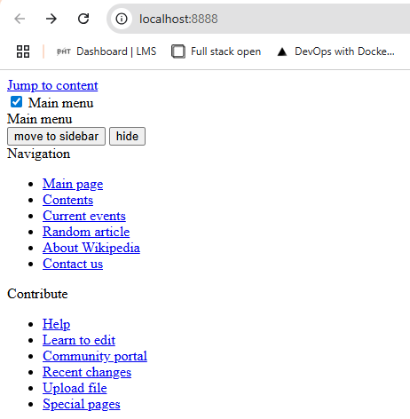
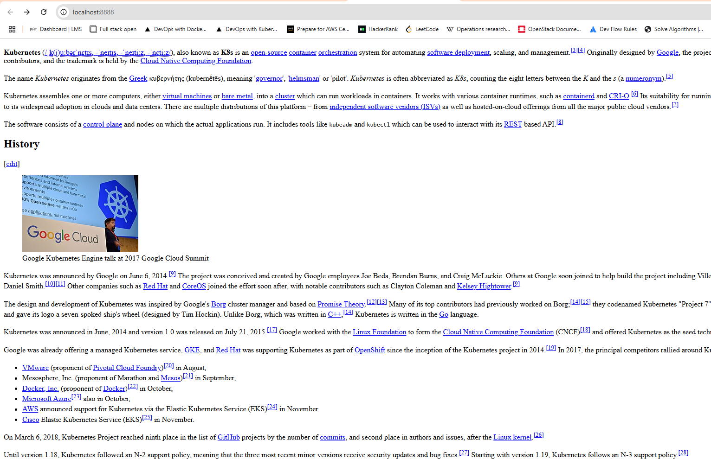

# Assignment

> This exercise doesn't rely on previous exercises. You may again choose whichever technologies you want for the implementation.
> 
> <span style="color:red">This exercise is difficult!</span>
> 
> We need a *DummySite* resource that can be used to create an HTML page from any URL.
> 
>   1. Create a "DummySite" resource that has a string property called "website_url".
>   1. Create a controller that receives a created "DummySite" object from the API
>   1. Have the controller create all of the resources that are required for the functionality.
>
> Refer to https://kubernetes.io/docs/reference/kubernetes-api/ and https://kubernetes.io/docs/reference/using-api/api-concepts/ for more information on Kubernetes API, and https://kubernetes.io/docs/reference/using-api/client-libraries/ for information about client libraries.
> 
> You may also take inspiration from the material example apps: [js](https://github.com/kubernetes-hy/material-example/tree/master/app10), [go](https://github.com/kubernetes-hy/material-example/tree/master/app10-go). Note that the JavaScript app does not quite utilize the features of [Kubernetes Client](https://github.com/kubernetes-client/javascript), but it calls the REST API directly.
> 
> Test that creating a DummySite resource with website_url "https://example.com/" creates a copy of the website. > With a more complex website your "copy" does not need to be a complete one. Eg. in https://en.wikipedia.org/wiki/Kubernetes the CSS styles can be broken:
> 
> 
>
> The controller doesn't have to work perfectly in all circumstances. The following workflow should succeed:
> 
> 1. apply role, account and binding.
> 1. apply deployment.
> 1. apply DummySite

# Solution

```bash
docker build -t bachthyaglx/dummysite-controller:latest .
docker push bachthyaglx/dummysite-controller:latest

kubectl apply -f manifests/crd.yaml
kubectl apply -f manifests/rbac.yaml
kubectl apply -f manifests/deployment.yaml
kubectl apply -f manifests/sample-dummysite.yaml

kubectl get pods
kubectl get configmaps
kubectl logs deployment/dummysite-controller

kubectl port-forward pod/wiki-copy-pod 8080:80
```

### Results



