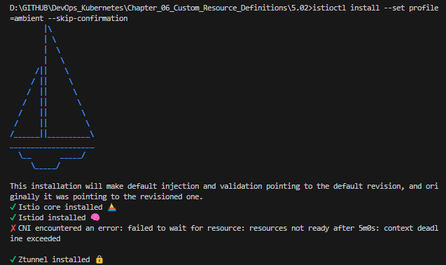
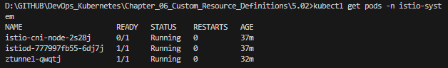
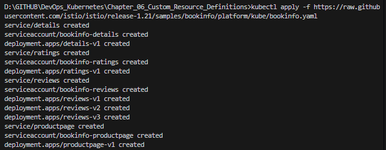
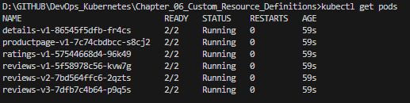
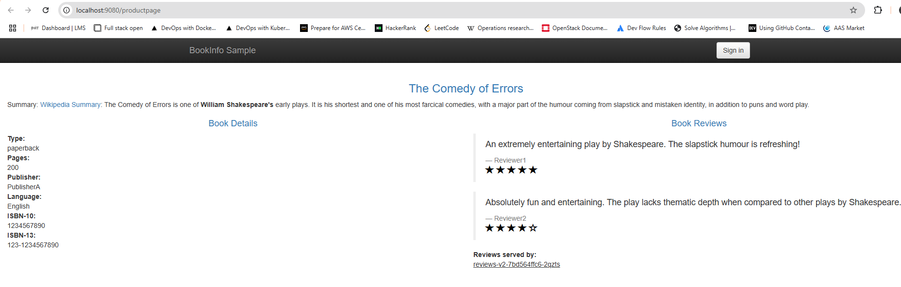

# Assignment

> Instructions
> Read now the following

> [https://istio.io/latest/docs/overview/what-is-istio/](https://istio.io/latest/docs/overview/what-is-istio/)
> [https://istio.io/latest/docs/overview/dataplane-modes/](https://istio.io/latest/docs/overview/dataplane-modes)
> [https://istio.io/latest/docs/ambient/overview/](https://istio.io/latest/docs/ambient/overview/)

> Install Istio CLI [https://istio.io/latest/docs/ambient/getting-started/](https://istio.io/latest/docs/ambient/getting-started/)

> Setup Istio to your k3d cluster [https://istio.io/latest/docs/ambient/install/platform-prerequisites/#k3d](https://istio.io/latest/docs/ambient/install/platform-prerequisites/#k3d)

> Deploy the Sample app [https://istio.io/latest/docs/ambient/getting-started/deploy-sample-app/](https://istio.io/latest/docs/ambient/getting-started/deploy-sample-app/) and follow the steps until Clean up.


### Commands

```bash
istioctl install --set profile=ambient --skip-confirmation
kubectl apply -f https://raw.githubusercontent.com/istio/istio/release-1.21/samples/bookinfo/platform/kube/bookinfo.yaml
kubectl get pods
kubectl annotate gateway bookinfo-gateway networking.istio.io/service-type=ClusterIP --namespace=default
kubectl get gateway
kubectl port-forward deploy/productpage-v1 9080:9080
```

### Results









