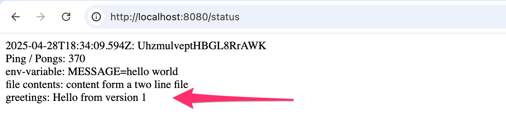

# Assignment

> Instructions
> Read now the following

> Deploy the Log to service mesh. Extend the app with a new service greeter that responds with a HTTP GET request with a greeting (such as hello). The log output app should use the greeter service and display the greeting among the rest of the output:

> 

> Once you get the basic setup working, deploy two versions of the greeter, and split the traffic so that the other (v1) gets 75% of the traffic and the other (v1) gets the rest. The setup looks in Kiali as follows:

> 

> Tips:

> * Our setup is very simillar to the one used in the Istio example app, see [here](https://istio.io/latest/docs/ambient/getting-started/manage-traffic/) and look how the manifests look like
> * As you see, the traffic splitting is done with a HTTPRoute object where you need to set a service (the greeter-svc) as a parentRefs
> * You need most likely three separate services for the greeter, the greeter-svc to which you attach the HTTPRoute that points to greeter-svc-1 and greeter-svc-2
> Use Kiali to ensure that the traffic is split correctly within the greeters.

### Commands

```bash
# log-output image
docker build -t bachthyaglx/log-output:latest ./log-output
docker push bachthyaglx/log-output:latest

# greeter v1
# (edit response message in app.js)
docker build -t bachthyaglx/greeter:v1 ./greeter
docker push bachthyaglx/greeter:v1

# greeter v2
# (edit response message in app.js to v2)
docker build -t bachthyaglx/greeter:v2 ./greeter
docker push bachthyaglx/greeter:v2

# Apply manifests
kubectl label namespace default istio-injection=enabled
kubectl apply -f manifests/

# Port forward
kubectl rollout restart deployment log-output
kubectl port-forward svc/log-output-svc 8081:80

# Test in browser
http://localhost:8080/status

```


NOTE: 
MUST also have 'Available version 2'

